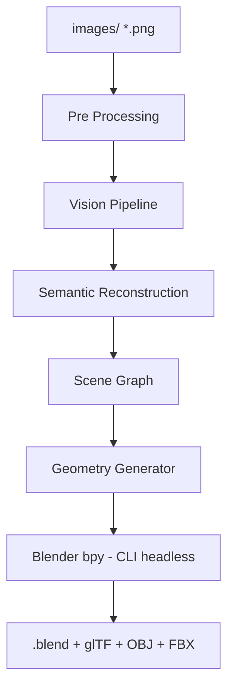
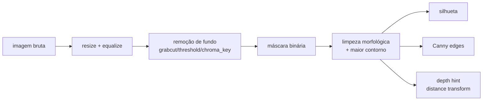
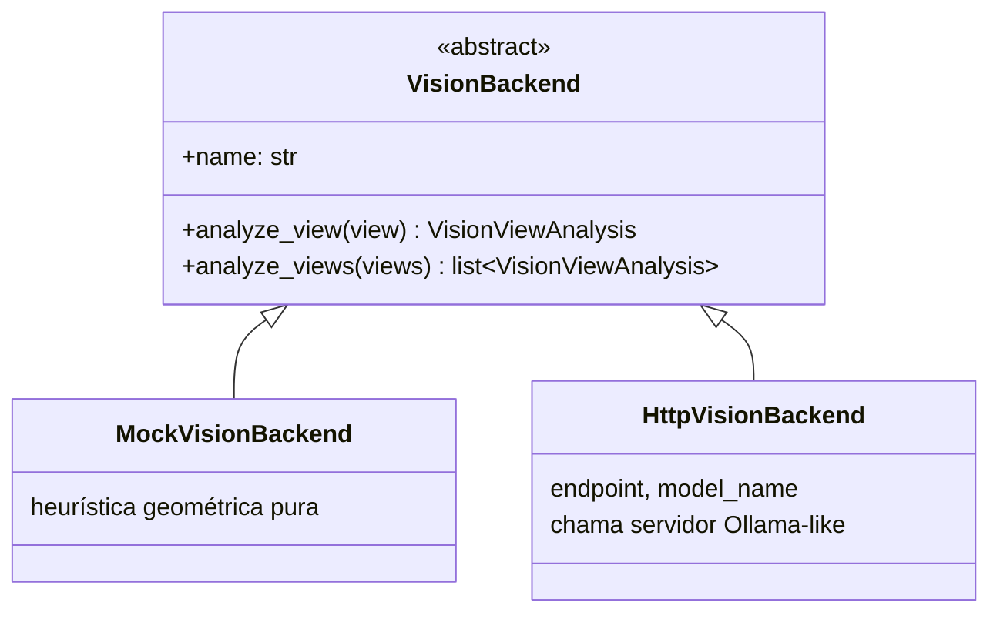
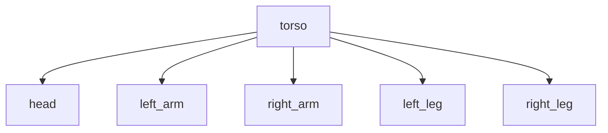
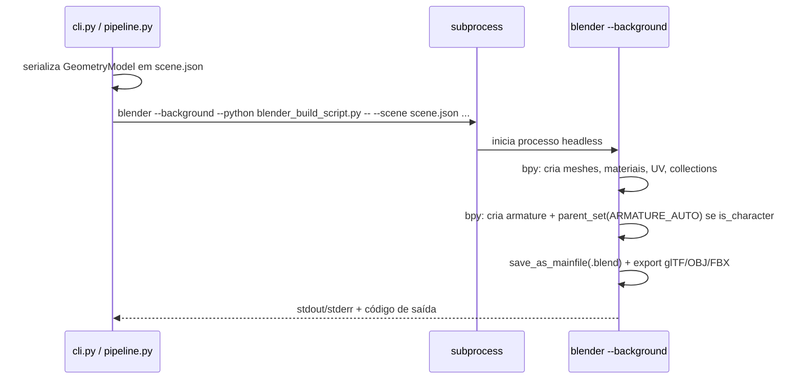
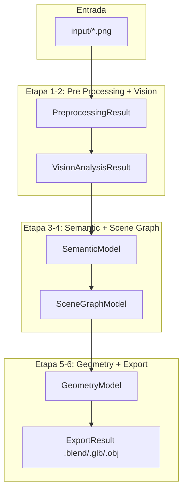

# Arquitetura

## Visão geral

Princípio central: **cada camada só conhece a camada imediatamente anterior
via um contrato Pydantic** (`src/blender_compiler/schemas.py`). Isso permite
substituir qualquer camada isoladamente (ex: trocar o Geometry Generator por
um baseado em NeRF) sem tocar nas demais.

## Camadas em detalhe

### 1. Pre Processing (`preprocessing/pipeline.py`)

Entrada: `PreprocessedView` por imagem (máscara, silhueta, bordas, bbox,
fill_ratio). Não interpreta semântica — só visão computacional clássica.

### 2. Vision Pipeline (`vision/`)

`HttpVisionBackend` é reaproveitado por Qwen-VL, LLaMA-Vision, MiniCPM e
Moondream — a diferença entre eles é apenas `model_name`/`endpoint` na
configuração (`config/default.yaml`). Se o servidor não responder, cai
automaticamente para `MockVisionBackend` (degradação graciosa).

### 3. Semantic Reconstruction (`semantic/pipeline.py`)

Funde as análises de todas as views num `SemanticModel`: partes, hierarquia
(`parent_id`), proporções relativas, grupo de simetria, material/cor
dominante. Se um membro simétrico não foi detectado em nenhuma view (ex:
`right_arm` ausente), é espelhado a partir do lado oposto.

### 4. Scene Graph (`scenegraph/pipeline.py`)

Implementado sobre `networkx.DiGraph`. Valida que o grafo é um DAG (sem
ciclos) e resolve posições absolutas por BFS a partir das raízes, somando
a posição relativa de cada nó à posição absoluta do pai. Exporta
`scene_graph.json`, `scene_graph.graphml` e um diagrama `scene_graph.mmd`
(Mermaid) por execução.

### 5. Geometry Generator (`geometry/`)

`primitives.py` contém builders puros (numpy/math, sem dependências
externas) para: `cube`, `sphere`, `capsule`, `cylinder`, `cone`, `torus`,
`plane`, `bezier`/`curve`. Cada um está registrado em `PRIMITIVE_BUILDERS`
— adicionar uma nova primitiva é registrar uma nova função aqui, sem tocar
em mais nada (Open/Closed Principle).

`pipeline.py` percorre o Scene Graph e instancia a primitiva sugerida pela
Etapa 4 para cada nó, aplicando escala/posição — produzindo `GeometryModel`
(dados de malha agnósticos de motor 3D).

### 6/7. Blender Export + Rig (`blender_export/`)

Decisão de design: em vez do pacote pip `bpy` (não-oficial, pesado, versão
fixa), o projeto invoca o **executável real do Blender** via `subprocess`
em modo `--background`, que é a forma oficialmente suportada de automação
via CLI. Se o executável `blender` não estiver no `PATH` (ex: ambiente dev
sem Blender), o sistema cai para um exportador OBJ puro-Python
(`fallback_obj.py`) para nunca travar o pipeline — mas a saída completa
(`.blend`, rig, UV, glTF) só é produzida com o Blender real presente,
como no container Docker.

O `blender_build_script.py` é o **único arquivo do projeto que importa
`bpy`** — todas as demais camadas são testáveis fora do Blender.

### 8. Rig opcional

Quando `SemanticModel.is_character` é verdadeiro e
`rig.enabled_for_characters` está ativo, `build_armature()` cria um osso por
parte seguindo as arestas do Scene Graph e usa
`bpy.ops.object.parent_set(type="ARMATURE_AUTO")` para pesos automáticos
(envelope/heat-map do próprio Blender).

## Fluxo de dados ponta a ponta

## Roadmap (interfaces já preparadas)

- **Fotogrametria / NeRF / Gaussian Splatting**: substituiriam a Etapa 1-2,
  produzindo diretamente uma nuvem de pontos consumida por uma nova
  Etapa 4 alternativa (mesma saída `SemanticModel`).
- **Text-to-3D**: novo backend em `vision/` que recebe texto em vez de
  imagem, mas ainda produz `VisionAnalysisResult`.
- **Geração procedural para jogos**: `GeometryModel` já é serializável em
  JSON — um exportador para engine de jogo é um novo módulo em
  `blender_export/`, análogo ao `fallback_obj.py`.
